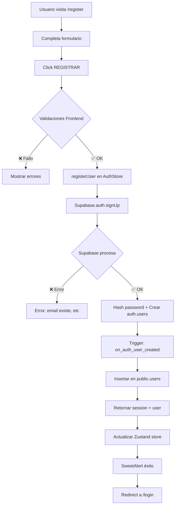

# Sistema de Autenticación con Email y Contraseña

## 📋 Descripción General

Este proyecto implementa un sistema de autenticación completo usando **Supabase Auth** con email y contraseña. Las contraseñas se almacenan de forma segura con hashing automático (bcrypt) proporcionado por Supabase.

---

## 🏗️ Arquitectura Implementada

### Stack Tecnológico
- **Frontend**: React 19 + Zustand (gestión de estado)
- **Backend/DB**: Supabase (PostgreSQL + Auth)
- **Validaciones**: Validaciones personalizadas en frontend
- **Alertas**: SweetAlert2
- **Routing**: React Router DOM v7
- **Styling**: Styled Components

### Flujo de Autenticación

```
Usuario → Formulario Login/Register → Zustand Store → Supabase Auth → PostgreSQL
                                                            ↓
                                            Trigger automático sincroniza
                                                            ↓
                                            public.users (tabla de negocio)
```

---

## 📁 Archivos Creados/Modificados

### ✅ Nuevos Archivos

1. **`src/components/templates/RegisterTemplate.jsx`**
   - Template de registro con validaciones
   - Campos: nombre, email, contraseña, confirmar contraseña
   - Validaciones: formato email, longitud contraseña (min 6), coincidencia contraseñas
   - Manejo de errores con SweetAlert2

2. **`src/pages/Register.jsx`**
   - Página wrapper para RegisterTemplate

3. **`database/sync_auth_users.sql`**
   - Script SQL para crear trigger automático
   - Sincroniza `auth.users` → `public.users` al registrar

### 🔄 Archivos Modificados

1. **`src/store/AuthStore.jsx`**
   - ❌ Eliminado: `loginGoogle` (OAuth Google)
   - ✅ Agregado:
     - `registerUser(email, password, name)`: Registro de usuarios
     - `loginEmailPassword(email, password)`: Login con credenciales
     - `initializeAuth()`: Inicializar sesión al cargar app
     - Estados: `user`, `session`, `loading`, `error`
     - Manejo de errores detallados

2. **`src/components/templates/LoginTemplate.jsx`**
   - ❌ Eliminado: Botón de Google, componente Linea
   - ✅ Agregado:
     - Formulario funcional con estado local
     - Validación de campos
     - Link a registro
     - Estados de carga

3. **`src/routers/routes.jsx`**
   - Agregada ruta `/register`

4. **`src/App.jsx`**
   - Actualizada condicional para incluir `/register` sin sidebar

5. **`src/index.js`**
   - Exportado `RegisterTemplate` y `Register`

---

## 🔐 Seguridad Implementada

### Hashing de Contraseñas
- ✅ **Supabase Auth maneja automáticamente el hashing con bcrypt**
- ✅ Las contraseñas NUNCA se almacenan en texto plano
- ✅ Hash generado por Supabase internamente antes de guardar en `auth.users`

### Validaciones Frontend
```javascript
// Validaciones implementadas:
- Email: formato válido (regex)
- Contraseña: mínimo 6 caracteres
- Confirmación: debe coincidir con contraseña
- Nombre: campo requerido
```

### Manejo de Errores
```javascript
// Mensajes de error específicos:
- "Credenciales incorrectas" → login fallido
- "Email no confirmado" → falta verificar email
- "Usuario inexistente" → email no registrado
```

---

## 🗄️ Base de Datos

### Tablas Utilizadas

#### 1. `auth.users` (Tabla nativa de Supabase)
```sql
-- Creada automáticamente por Supabase
-- Contiene:
- id (uuid): ID único del usuario
- email: Email del usuario
- encrypted_password: Contraseña hasheada (bcrypt)
- email_confirmed_at: Timestamp confirmación email
- raw_user_meta_data: JSON con datos adicionales (name)
- created_at, updated_at
```

#### 2. `public.users` (Tabla de negocio)
```sql
-- Tabla existente sincronizada con trigger
CREATE TABLE public.users (
  id bigint PRIMARY KEY,
  name text DEFAULT '-',
  email text DEFAULT '',
  id_auth text UNIQUE, -- UUID de auth.users
  registration_date date,
  state text DEFAULT 'ACTIVE',
  id_doc_type bigint,
  doc_number text,
  tel text,
  id_role bigint,
  ...
);
```

### Sincronización Automática

**Trigger SQL** (`sync_auth_users.sql`):
```sql
-- Se ejecuta automáticamente al registrar usuario
-- Crea registro en public.users con:
- id_auth = auth.users.id
- email = auth.users.email
- name = metadata o parte del email
- registration_date = fecha actual
- state = 'ACTIVE'
```

---

## 🚀 Configuración e Instalación

### 1. Configurar Base de Datos

#### Opción A: Ejecutar Trigger Manualmente
```bash
# 1. Ir a Supabase Dashboard
# 2. Navegar a SQL Editor
# 3. Copiar y pegar el contenido de database/sync_auth_users.sql
# 4. Ejecutar (Run)
```

#### Opción B: Revisar si ya existe
```sql
-- Verificar si el trigger ya está creado
SELECT * FROM pg_trigger WHERE tgname = 'on_auth_user_created';
```

### 2. Variables de Entorno

Asegúrate de tener configurado `.env`:
```env
VITE_APP_SUPABASE_URL=https://tu-proyecto.supabase.co
VITE_APP_SUPABASE_ANON_KEY=tu-anon-key
```

### 3. Configuración de Supabase Auth

En **Supabase Dashboard → Authentication → Settings**:

```yaml
# Email Auth
Email Auth: Enabled ✅
Confirm Email: Enabled (recomendado) o Disabled (para testing)

# OAuth Providers (OPCIONAL - puedes deshabilitarlos)
Google: Disabled ❌
```

### 4. Inicializar Autenticación en App

Agregar en `src/main.jsx` o donde inicialices la app:

```jsx
import { useEffect } from 'react';
import { useAuthStore } from './store/AuthStore';

function AppWrapper() {
  const { initializeAuth } = useAuthStore();
  
  useEffect(() => {
    initializeAuth();
  }, []);
  
  return <App />;
}
```

---

## 📖 Uso del Sistema

### Registrar Usuario

```javascript
const { registerUser } = useAuthStore();

const handleRegister = async () => {
  const result = await registerUser(
    'usuario@ejemplo.com',
    'password123',
    'Juan Pérez'
  );
  
  if (result.success) {
    console.log('Usuario registrado:', result.data.user);
  } else {
    console.error('Error:', result.error);
  }
};
```

### Iniciar Sesión

```javascript
const { loginEmailPassword } = useAuthStore();

const handleLogin = async () => {
  const result = await loginEmailPassword(
    'usuario@ejemplo.com',
    'password123'
  );
  
  if (result.success) {
    console.log('Sesión iniciada:', result.data.user);
  } else {
    console.error('Error:', result.error);
  }
};
```

### Cerrar Sesión

```javascript
const { cerrarSesion } = useAuthStore();

await cerrarSesion();
```

### Acceder al Usuario Actual

```javascript
const { user, session } = useAuthStore();

console.log('Usuario actual:', user);
console.log('Email:', user?.email);
console.log('Sesión activa:', !!session);
```

---

## 🎨 Componentes UI

### LoginTemplate
- **Ruta**: `/login` o `/`
- **Campos**: Email, Contraseña
- **Acciones**: Login, Link a registro
- **Validaciones**: Campos requeridos

### RegisterTemplate
- **Ruta**: `/register`
- **Campos**: Nombre, Email, Contraseña, Confirmar contraseña
- **Acciones**: Registro, Link a login
- **Validaciones**:
  - Email válido
  - Contraseña min 6 caracteres
  - Contraseñas coinciden
  - Nombre requerido

---

## 🔍 Manejo de Errores

### Errores Comunes y Soluciones

| Error | Causa | Solución |
|-------|-------|----------|
| `Invalid login credentials` | Email o contraseña incorrectos | Verificar credenciales |
| `Email not confirmed` | Email no verificado | Revisar bandeja de correo |
| `User already registered` | Email ya existe | Usar otro email o iniciar sesión |
| `Password should be at least 6 characters` | Contraseña muy corta | Usar mínimo 6 caracteres |

### Códigos de Estado

```javascript
// AuthStore retorna objetos con:
{
  success: boolean,
  data?: object,    // Solo si success === true
  error?: string    // Solo si success === false
}
```

---

## 🧪 Testing Manual

### 1. Registrar Nuevo Usuario
```bash
1. Navegar a /register
2. Completar formulario:
   - Nombre: "Test User"
   - Email: "test@ejemplo.com"
   - Contraseña: "password123"
   - Confirmar: "password123"
3. Click "REGISTRAR"
4. Verificar:
   - SweetAlert de éxito
   - Redirección a login
   - Email de confirmación recibido (si está habilitado)
```

### 2. Iniciar Sesión
```bash
1. Navegar a /login
2. Ingresar credenciales:
   - Email: "test@ejemplo.com"
   - Contraseña: "password123"
3. Click "INGRESAR"
4. Verificar:
   - Redirección a /home
   - Usuario cargado en store
   - Sesión activa
```

### 3. Verificar Sincronización DB
```sql
-- En Supabase SQL Editor:
SELECT * FROM public.users WHERE email = 'test@ejemplo.com';
-- Debe mostrar el usuario con id_auth correspondiente
```

---

## 🛠️ Troubleshooting

### Problema: "Email not confirmed"
**Solución**:
```sql
-- Opción 1: Deshabilitar confirmación en Supabase Dashboard
-- Authentication → Settings → Confirm Email: OFF

-- Opción 2: Confirmar manualmente
UPDATE auth.users 
SET email_confirmed_at = NOW() 
WHERE email = 'usuario@ejemplo.com';
```

### Problema: Usuario no se crea en public.users
**Solución**:
```sql
-- Verificar que el trigger existe
SELECT * FROM pg_trigger WHERE tgname = 'on_auth_user_created';

-- Recrear trigger si no existe
-- Ejecutar: database/sync_auth_users.sql
```

### Problema: Session no persiste al recargar
**Solución**:
```javascript
// Verificar que initializeAuth se ejecuta en App
useEffect(() => {
  useAuthStore.getState().initializeAuth();
}, []);
```

---

## 📊 Diagrama de Flujo



---

## 🎯 Características Implementadas

- ✅ Registro de usuarios con email/contraseña
- ✅ Login con email/contraseña
- ✅ Hash automático de contraseñas (bcrypt)
- ✅ Validaciones frontend completas
- ✅ Manejo de errores detallado
- ✅ Sincronización automática auth.users → public.users
- ✅ Estados de carga
- ✅ Mensajes de error específicos
- ✅ Redirecciones automáticas
- ✅ UI/UX consistente con el diseño existente
- ✅ Protección de rutas
- ✅ Persistencia de sesión

---

## 🚫 Eliminado

- ❌ Login con Google OAuth
- ❌ Cualquier dependencia de proveedores externos
- ❌ Botón "Continuar con Google"
- ❌ Componente Linea (separador "o")

---

## 📝 Notas Adicionales

### Personalización de Emails
En **Supabase Dashboard → Authentication → Email Templates** puedes personalizar:
- Email de confirmación
- Email de recuperación de contraseña
- Email de cambio de email

### Recuperación de Contraseña (Futuro)
Para implementar "¿Olvidaste tu contraseña?":
```javascript
const { data, error } = await supabase.auth.resetPasswordForEmail(email, {
  redirectTo: 'https://tu-app.com/reset-password',
});
```

### Políticas de Row Level Security (RLS)
Asegúrate de configurar políticas en `public.users`:
```sql
-- Permitir que usuarios vean solo sus propios datos
CREATE POLICY "Users can view own data" ON public.users
FOR SELECT USING (auth.uid()::text = id_auth);
```

---

## 🤝 Soporte

Para dudas o problemas:
1. Revisar logs en consola del navegador
2. Verificar configuración en Supabase Dashboard
3. Revisar triggers en SQL Editor
4. Comprobar variables de entorno

---

**✨ Sistema de autenticación implementado exitosamente ✨**
